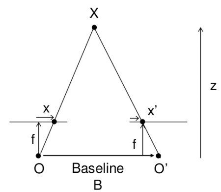
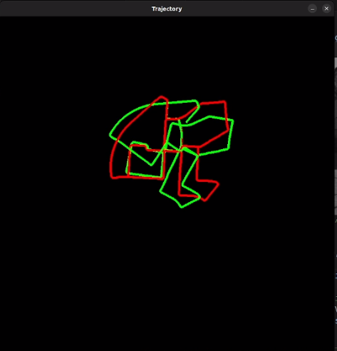
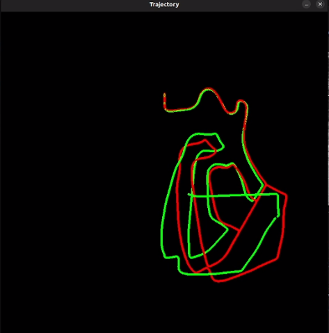
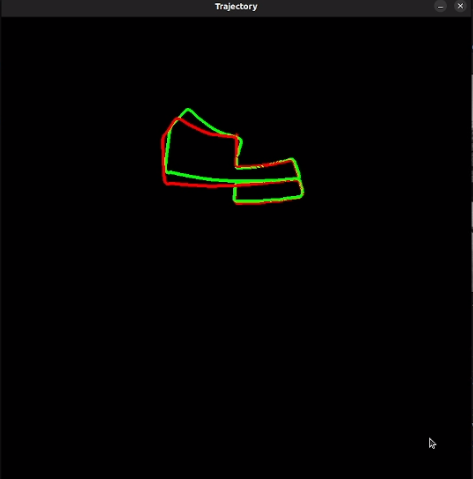
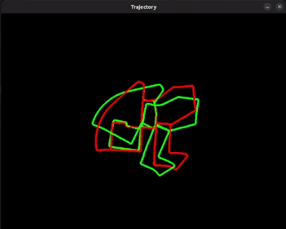
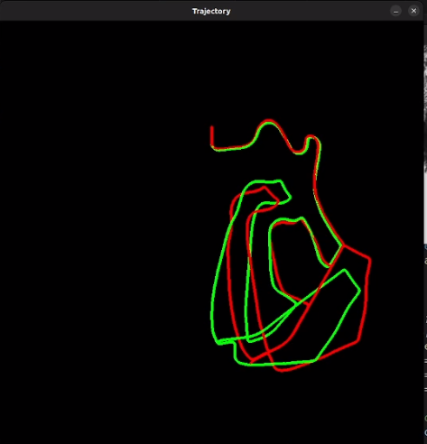
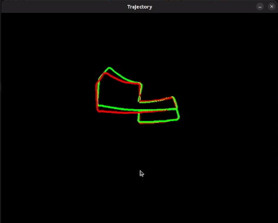

# Stereo Visual Odometry (SVO)

## OVERVIEW

This project implements **Stereo Visual Odometry** using the **KITTI Odometry Dataset**.
It estimates the motion of a stereo camera rig (left + right cameras) by tracking features across consecutive frames and recovering the relative pose between them.

Two different approaches are implemented:

1. **Feature Matching with ORB** — Detects and describes features in each frame, matches them, and estimates motion.
2. **Feature Tracking with Lucas–Kanade (LKT)** — Tracks existing features across frames without computing descriptors.

---

## KEY CONCEPTS

### 1. Stereo Vision

A stereo camera captures two images at the same time from slightly different viewpoints:

By finding corresponding points in left & right images, we can compute **disparity**:

**Disparity formula**:

$$
\text{disparity} = x_{\text{left}} - x_{\text{right}}
$$

**Depth formula**:

$$
Z = \frac{f \cdot B}{\text{disparity}}
$$

Where:

* $Z$ = depth
* $f$ = focal length
* $B$ = baseline distance between cameras

---

### 2 Feature Detection & Bucketing (even feature distribution)

To avoid feature clusters (e.g., only on textured areas) and improve robustness/speed, we **bucket** features:

* **Detect** many candidate keypoints (FAST or ORB detector).
* **Divide** the image into a grid (tiles).
* **Keep** the top $N$ keypoints per tile by score (response).
* **(ORB approach)** Compute ORB **descriptors** only for the kept keypoints.

**Benefits:**

* Better geometric coverage → more stable pose estimation.
* Predictable cap on feature count → faster matching/flow.
* Robust to texture imbalance (e.g., sky/road dominating).

**Typical parameters (tuned per dataset):**

* Tile size: e.g. 10×20 px (H×W).
* Max per tile: 10–20 features.
* FAST threshold: small (e.g., 3–10) if you do post-filtering; higher for fewer, stronger corners.

---

### 3 Feature Matching / Tracking

We need **two types** of correspondences:

* **Stereo (L–R at the same time)** → to get depth.
* **Temporal (t → t+1 on the left camera)** → to estimate motion.

**ORB approach (main branch):**

* Detect + bucket keypoints on L and R.
* Compute ORB descriptors for L and R (and for L at t+1).
* **Stereo match:** BFMatcher(Hamming, crossCheck=true) between L and R descriptors.

  * Filter: positive disparity, small vertical offset (epipolar constraint), distance threshold.
* **Temporal match:** BFMatcher between L_t and L_t+1 descriptors.

**KLT approach (KLT branch):**

* Detect + bucket initial points (e.g., FAST) on the left.
* **Temporal tracking:** `cv::calcOpticalFlowPyrLK` from L_t → L_t+1.

  * Use `status` mask to keep only good tracks.

* **Stereo correspondence:** either

  * Track with LK from L to R (search constrained horizontally), or
  * Re-detect + match (if you need reinitialization), or
  * Sample along the epipolar line (rectified → same row) within a small window.

**Outlier rejection (both):**

* Remove matches with negative/near-zero disparity.
* Use geometric checks (row difference for rectified stereo, RANSAC for temporal).
* Cap max pixel motion or residuals.

---
### 4 3D Point Reconstruction (from stereo)

With stereo correspondences for points $(x_L, y_L)$ and $(x_R, y_R)$, compute:

$$
d = x_L - x_R,\quad
Z = \frac{f \cdot B}{d},\quad
X = \frac{(x_L - c_x)\,Z}{f},\quad
Y = \frac{(y_L - c_y)\,Z}{f}
$$

---

### 5. Motion Estimation

Once we know the 3D position of points at time $t$ and $t+1$, we find the transformation (**rotation + translation**) that best aligns them.
This is solved with **Perspective-n-Point (PnP)** and refined with **Levenberg–Marquardt** optimization to minimize **reprojection error**.

---

## APPROACH 1 — ORB Descriptors + Matching --> main branch

**Pipeline:**

1. **Detect keypoints** in the left image using ORB.
2. **Compute descriptors** for each keypoint.
3. **Match features** between:

   * Left and right images (depth estimation).
   * Left image at frame $t$ and left image at frame $t+1$ (motion estimation).
4. Triangulate 3D points from stereo matches.
5. Solve **PnP** to recover camera pose change.

**Pros:**
✔ Robust to large motion.
✔ Handles moderate appearance changes.

**Cons:**
✘ Slower due to descriptor computation.

---

## APPROACH 2 — Lucas–Kanade Optical Flow (LKT) --> KLT branch

**Pipeline:**

1. Detect keypoints in the first left frame (FAST).
2. Track these points across frames using **pyramidal LKT**.
3. Stereo match (left–right) to estimate depth.
4. Apply **PnP** to estimate motion.

**Pros:**
✔ Faster, no descriptors.
✔ Lower CPU usage.

**Cons:**
✘ Sensitive to occlusion and large viewpoint changes.
✘ More drift over time.

---

## RESULTS

The project visualizes:

* **Estimated trajectory** from VO (red).
* **Ground truth trajectory** from KITTI (green).
* A `traj_scale` parameter allows adjusting the trajectory display.

 ## Images from the ORB descriptor matching approach:

## Images from the KLT approach:

---

## Conclusion

Both approaches demonstrate the core principles of Stereo Visual Odometry.
The **ORB-based method** is more robust to appearance changes and larger motions but comes with higher computational cost due to descriptor extraction and matching.
On the other hand, the **Lucas–Kanade (LKT) approach** is significantly lighter, making it better suited for real-time applications. With well-tuned parameters (feature selection, pyramid levels, bucketing), LKT can achieve accurate and stable results while maintaining efficiency.
