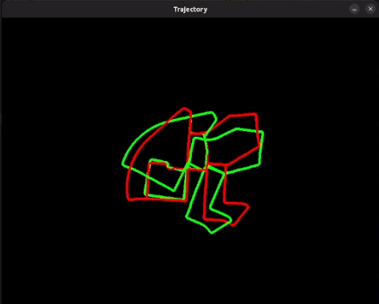
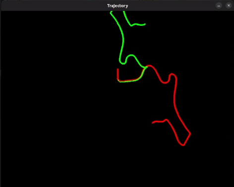
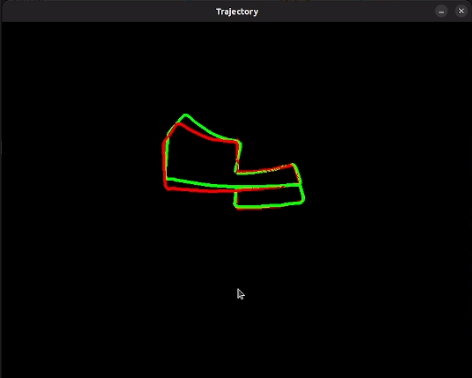

# Stereo Visual Odometry (SVO)

## 📖 Overview

This project implements **Stereo Visual Odometry** using the **KITTI Odometry Dataset**.
It estimates the motion of a stereo camera rig (left + right cameras) by tracking features across consecutive frames and recovering the relative pose between them.

Two different approaches are implemented:

1. **Feature Matching with ORB** — Detects and describes features in each frame, matches them, and estimates motion.
2. **Feature Tracking with Lucas–Kanade (LKT)** — Tracks existing features across frames without computing descriptors.

---

## 🎯 Key Concepts

### 1. Stereo Vision

A stereo camera captures two images at the same time from slightly different viewpoints:

By finding corresponding points in left & right images, we can compute **disparity**:

**Disparity formula**:

$$
\text{disparity} = x_{\text{left}} - x_{\text{right}}
$$

**Depth formula**:

$$
Z = \frac{f \cdot B}{\text{disparity}}
$$

Where:

* $Z$ = depth
* $f$ = focal length
* $B$ = baseline distance between cameras

---

### 2. Motion Estimation

Once we know the 3D position of points at time $t$ and $t+1$, we find the transformation (**rotation + translation**) that best aligns them.
This is solved with **Perspective-n-Point (PnP)** and refined with **Levenberg–Marquardt** optimization to minimize **reprojection error**.

---

## APPROACH 1 — ORB Descriptors + Matching --> main branch

**Pipeline:**

1. **Detect keypoints** in the left image using ORB.
2. **Compute descriptors** for each keypoint.
3. **Match features** between:

   * Left and right images (depth estimation).
   * Left image at frame $t$ and left image at frame $t+1$ (motion estimation).
4. Triangulate 3D points from stereo matches.
5. Solve **PnP** to recover camera pose change.

**Pros:**
✔ Robust to large motion.
✔ Handles moderate appearance changes.

**Cons:**
✘ Slower due to descriptor computation.

---

## APPROACH 2 — Lucas–Kanade Optical Flow (LKT) --> KLT branch

**Pipeline:**

1. Detect keypoints in the first left frame.
2. Track these points across frames using **pyramidal LKT**.
3. Stereo match (left–right) to estimate depth.
4. Apply **PnP** to estimate motion.

**Pros:**
✔ Faster, no descriptors.
✔ Lower CPU usage.

**Cons:**
✘ Sensitive to occlusion and large viewpoint changes.
✘ More drift over time.

---

## RESULTS

The project visualizes:

* **Estimated trajectory** from VO (red).
* **Ground truth trajectory** from KITTI (green).
* A `traj_scale` parameter allows adjusting the trajectory display.

In the

